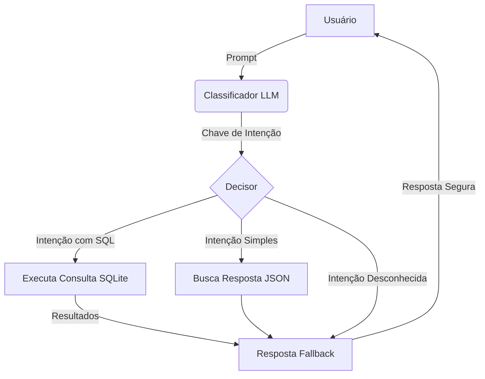

# ChatBot classificador de intenções
Este projeto implementa um chatbot que utiliza um modelo de linguagem (LLM) para classificação de intenções e executa consultas SQL predefinidas em um banco de dados, retornando os resultados formatados.  A abordagem resolve um problema fundamental em sistemas baseados em IA: o risco de "delírios" ou alucinações dos LLMs, onde o modelo gera respostas incorretas, inventadas ou inconsistentes.

## Pré-requisitos
- Python 3.8+

- Conta na Groq Cloud para obter API key

## Configuração

### 1. Instalar dependências

```bash
pip install -r requirements.txt
```

### 2. Configurar arquivos JSON

Alterar como desejado as intenções e suas respostas, além das consultas sobre a tabela.

### 3. Configurar API Key da Groq

No código chatbot.py, substitua: 

```python
self.client = Groq(api_key="SUA_API_KEY_AQUI")
```

## Como Executar

```python
python chatbot.py
```

### Fluxo de Funcionamento



#### Entrada do usuário como POST:

```json
{
    "prompt": "Olá, tudo bem?"
}
```

#### Classificação de intenção:

1. O sistema envia o prompt para a API Groq

2. O LLM classifica a intenção e retorna uma chave

#### Processamento:

Se a intenção tiver uma query SQL associada:

1. Executa a consulta no banco SQLite

2. Formata os resultados

Se não, usa a resposta pré-definida do JSON:

```json
{
    "response": "Olá! Como posso ajudar?"
}
```

## Para adicionar novas funcionalidades:

1. Adicione uma nova entrada em intents.json com padrões de perguntas

2. Crie uma entrada correspondente em responses.json com a resposta

Se precisar de dados do banco:

1. Adicione a consulta SQL em queries.json

2. Atualize o banco de dados com os dados necessários